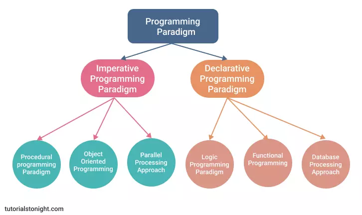

# *Programming Paradigms*
1. **Imperative Programming** 
   -> It performs step by step task by changing state. The main focus is on how to achieve the goal.
	- **Procedural Programming** ->It is group of instructions that perform a specific task.Ex: ATM .
	- **Object-Oriented Programming** -> It is based on the concept of objects which can contain 
	 data in the form of fields and code in the form of procedures. Ex: Java, C++.
	
	

	
	|principles|              |
    |-----------|-------------|
	|encapsulation|things i know and control.|
	|inheritance|inheritance of a particular trait.|
	|polymorphism|multi forms of the same function.|
	|abstraction|stripping away unnecessary needs.|

     the OOP simulates reality by creating objects that have attributes and methods.
	
	- **Parallel Programming** -> It is an implementation method that divides a problem into multiple parts and solves them at same time.
	
2. **Declarative Programming** -> It focuses on what to achieve rather than how to achieve it. it not interact with the user.
	- **Functional Programming**-> It is based on the concept of mathematical functions. Ex: Haskell.
	- **Logic Programming**-> It is based on the facts and rules. Ex: Prolog.
	
	- **Database Programming** -> It is based on the concept of database management system.The final result is Data. Ex: SQL.

	

	